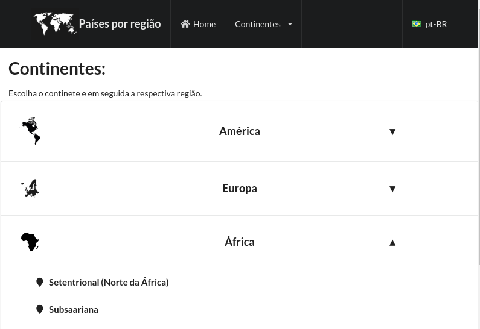
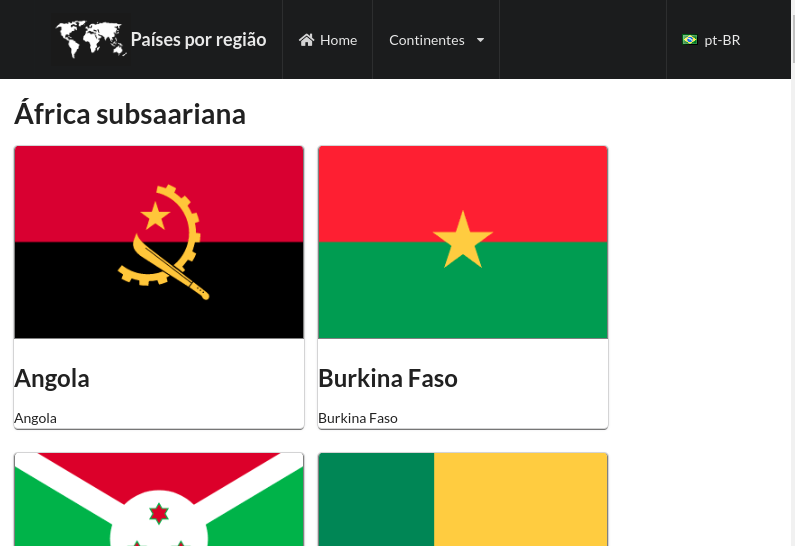

# Países por Região

## Sobre o Projeto
Esta aplicação foi desenvolvida com o objetivo de proporcionar ao usuário conhecer os detalhes dos países selecionados, de acordo com a região de cada continente, conforme dados publicados pelo Instituto Brasileiro de Geografia e Estatística (IBGE).

## Tecnologias e Ferramentas empregadas
JavaScript;
React JS;
HTML;
CSS (framework: Semantic-Ui);
Context-Api; e
React Router DOM.

## Status do Projeto
Aplicação em funcionamento; e 
Testes em React Testing Library (RTL) em desenvolvimento.

## Acesso à Aplicação
### Instalação e Execução
Primeiramente deve ser realizado o Fork e o Clone do repositório. Dentro do diretório do repositório realize a instalação das dependências, através do comando npm install, e execute o projeto, através do comando npm start.

## Contribuintes
|Nome|GitHub|
| -------- | -------- |
|Moisés Fernandes|https://github.com/moisesfdasilva|

## Contato
[GitHub: Repositório-paises-por-regiao](https://github.com/moisesfdasilva/paises-por-regiao)
